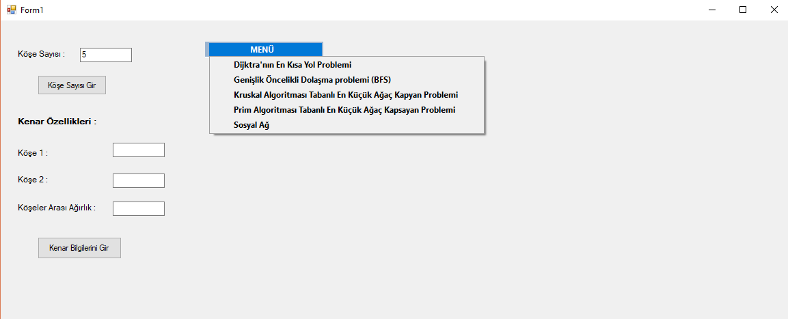
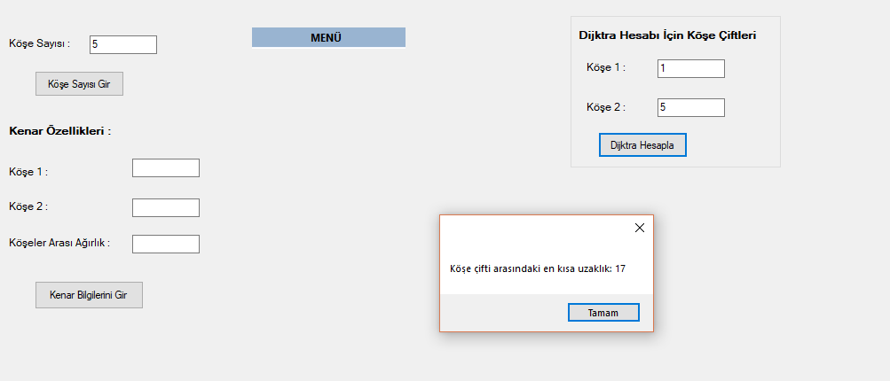
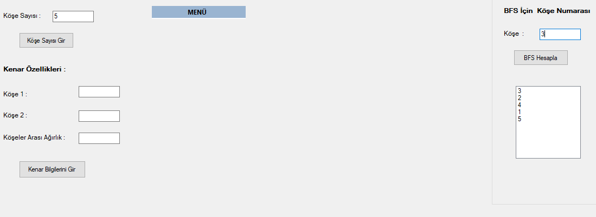
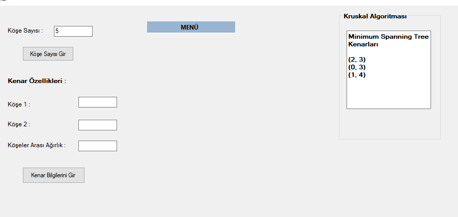
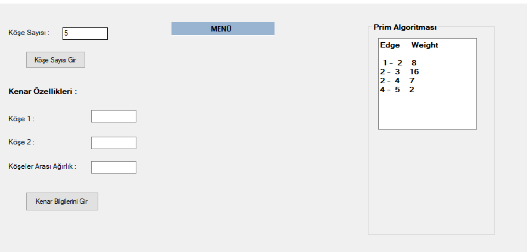
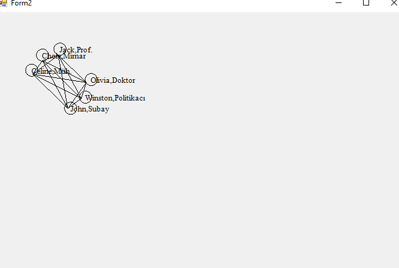

# CizgelerVeSosyalAglar

<h2>Projenin Amacı</h2>

Kullanıcının girdiği köşeler ve köşeler arası ağırlıklara göre;

   <ul>
      <li>Dijktra Yol Problemi</li>
      <li>Geniş Öncelikli Dolaşma Problemi</li>
      <li>Kruskal Algoritması Tabanlı En Küçük Kapsayan Ağaç Problemi</li>
      <li>Prim Algoritması Tabanlı En Küçük Kapsayan Ağaç Problemi</li>
   </ul>

algoritmalarının çözümüne lişkin algoritmalar geliştirilmiştir.

Ayrıca projede belirlenen verilerden Sosyal Ağ yapısı çizdirilmiştir.

  
  <h2>Ekran Görüntüleri</h2>
  
  
  
  
  
  
  

  
  
